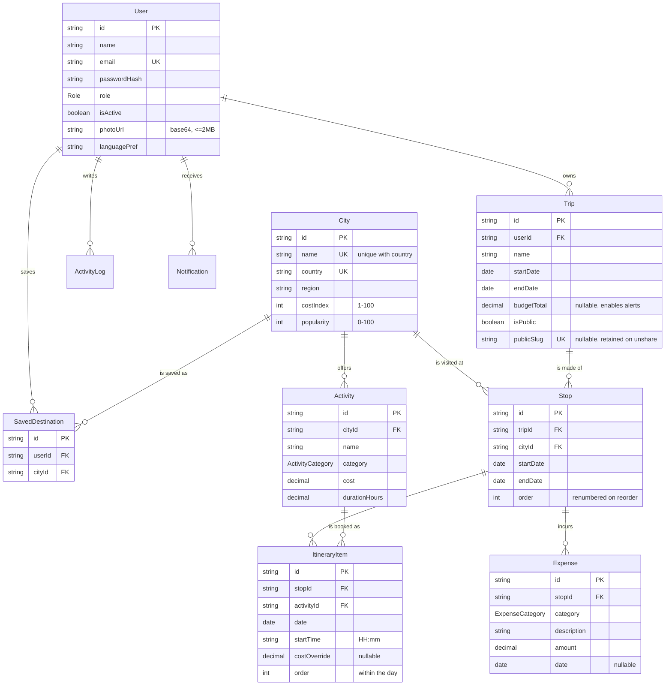

# DATABASE

Postgres on Neon (pooled connection string). Prisma 6 client, `prisma db push` — no migration
history, the schema is the source of truth for a one-day build.

```bash
npm run db:push    # sync schema.prisma to Neon
npm run db:seed    # catalog + demo accounts
npm run db:reset   # wipe and re-seed (use before the demo)
```

## ER diagram



## Cascade behaviour

| Delete | Cascades to |
|---|---|
| User | Trips, SavedDestinations, ActivityLogs, Notifications |
| Trip | Stops → ItineraryItems, Expenses |
| Stop | ItineraryItems, Expenses |
| City | Activities, SavedDestinations (blocked while a Stop references it — 409) |

`Stop.city` and `ItineraryItem.activity` are restrict-by-default: catalog rows in use cannot be
deleted out from under a planned trip.

## Date storage

Trip, Stop, ItineraryItem and Expense dates are calendar days stored as `DateTime` pinned to
**UTC midnight** (`src/lib/dates.ts`). Comparisons are date-only. See `docs/DECISIONS.md` D-03.

## Seed contents

| | |
|---|---|
| Cities | 31 across Europe, Asia, Middle East, Africa, North America, South America, Oceania |
| Activities | 310 (10 per city) across 8 categories |
| Trips | 4 — upcoming / ongoing / past+public for `user@demo.com`, 1 public for `friend@demo.com` |

### Demo credentials — password `Demo@123`

| Email | Role | What it demonstrates |
|---|---|---|
| `admin@demo.com` | ADMIN | Analytics dashboard, user management, catalog CRUD |
| `user@demo.com` | USER | The main demo path — 3 trips, one fully built with a deliberate over-budget day |
| `friend@demo.com` | USER | Owns a public trip so Copy Trip can be demonstrated end to end |

Public links: `/p/iceland-ring-road-demo` · `/p/sea-shoestring-demo`
